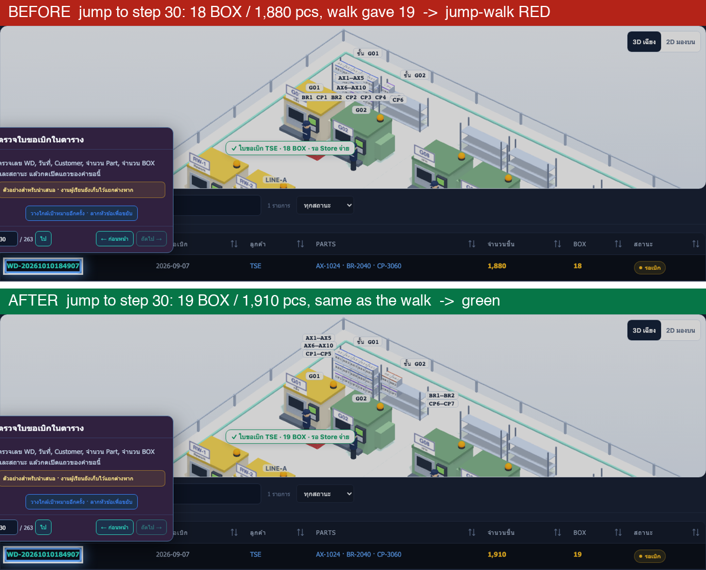
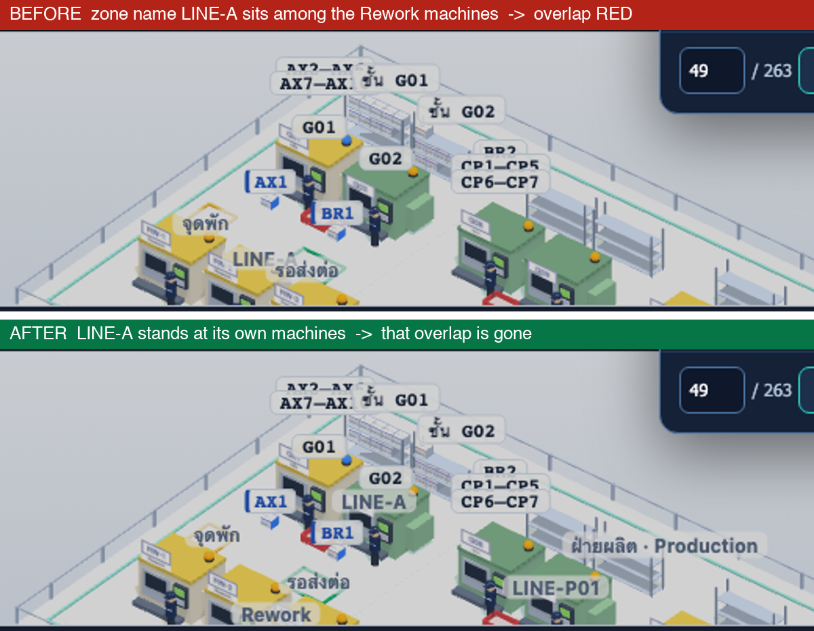
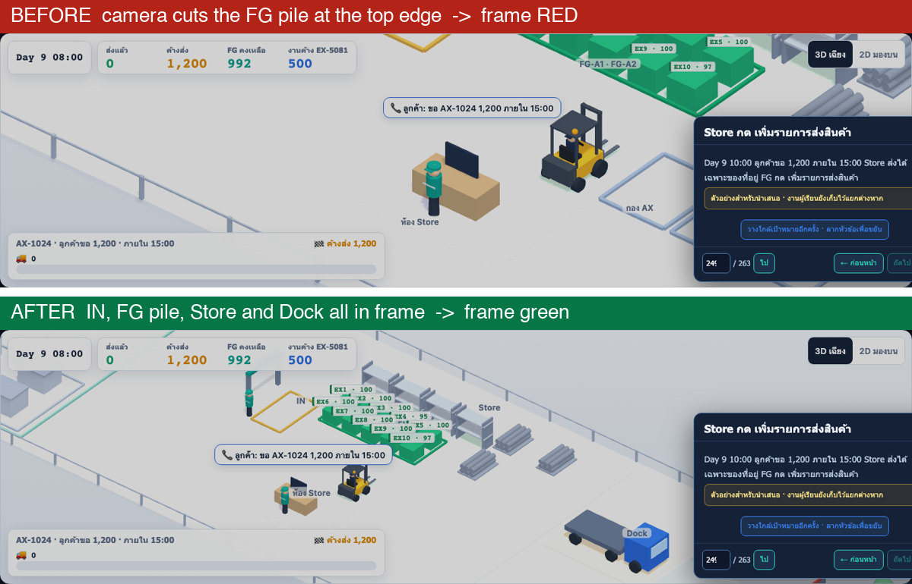
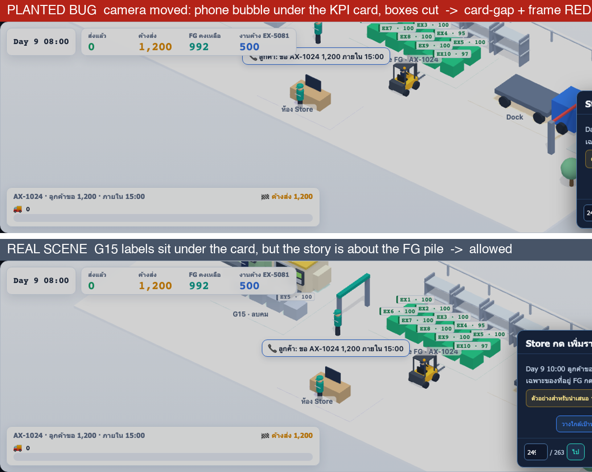

# threejs-guided-scene

A skill for building and guarding a **step-by-step 3D scene**: a Three.js (or any WebGL)
picture with HTML labels, bubbles and a camera that tell a story one step at a time, such as
a factory or warehouse demo, a product tour, or a training walkthrough.

The skill is the idea. The [`example/`](example/) folder shows what a guard built from it
looks like, and its tests show the guard going red.

## The idea in one paragraph

The picture is pixels, but everything worth checking is data: label boxes are HTML on top
of the canvas, and thing positions sit in a scene snapshot. So the guard **measures** instead
of looking. It never compares screenshots and never asks an AI to look at a picture and judge
it. Each step names the few things its story is about (`mustSee`); only those must stay
readable. When the end-to-end tests and the guard are both green, the agent is done; the
owner looks once and judges the story.

## What it catches

These are real bugs from a production demo, each caught by one rule: red on the commit
before the fix, green on the commit after.

### jump-walk: the shortcut builds a different scene

Pressing through the steps gave 19 boxes. Jumping straight to step 30 gave 18. Nobody needs
to know the right answer; the two routes disagree, so one of them is wrong.

### stay-put: something moves that nobody moved

Moving boxes CP1–CP5 onto rack G02 also dropped CP6 and CP7, already on that rack, from the
second shelf to the floor. On screen the boxes are a few pixels wide, so before and after
pictures look identical. The numbers do not:

| Thing | Place | Step 43 height | Step 44 height | Rule |
|---|---|---:|---:|---|
| CP6, CP7 before the fix | rack G02 | 0.83 m | 0.08 m | stay-put **red** |
| CP6, CP7 after the fix | rack G02 | 0.83 m | 0.83 m | green |

### overlap: a label lands on another

The zone name LINE-A was drawn among the Rework machines, on top of their labels. The fix
stands each zone name at its own zone.

### frame: the camera cuts what the story is about

The camera framed the FG pile so tightly that its top row and labels left the picture.

### card-gap: a must-see label slides under a card

When the original bug could not be shown any more, a bug was planted: the camera was moved so
the customer's phone bubble slid under the KPI card. The guard went red. The real scene
below has other labels under the same card, and that is allowed: the story at this step is
the FG pile, not those.

## What it does not catch

- Whether the picture tells the story. The owner judges that, once, at the end.
- Motion between steps. stay-put compares the scene at rest after each step.
- Bugs where walk and jump are wrong in the same way.

## Files

| File | What it is |
|---|---|
| [`SKILL.md`](SKILL.md) | The skill: step contract, six rules with sources, done criteria |
| [`example/probe.js`](example/probe.js) | In-page probe: reads labels, cards and the scene snapshot |
| [`example/sweep.spec.ts`](example/sweep.spec.ts) | Playwright sweep: walks and jumps every step, then judges |
| [`example/judge.mjs`](example/judge.mjs) | The six rules, as a pure function over facts |
| [`example/judge.test.mjs`](example/judge.test.mjs) | Plants one bug per rule into green facts and expects red |
| [`example/fixtures/`](example/fixtures/) | Green and red facts for a three-step warehouse scene |

## Where the numbers come from

| Number | Source |
|---|---|
| 2 px label gap | MapLibre GL `text-padding` default |
| 0 px edge | Plotly.js test helper `assertElemInside` (strict containment) |
| Exact jump-walk match, blank guard | Babylon.js equivalence tests |
| 8 px card gap | Project rule; no reference project sets one |
| 0.05 m move | Positions are rounded to 1 cm |

There is no minimum label size: MapLibre, Plotly and Cesium have defaults, not floors.
